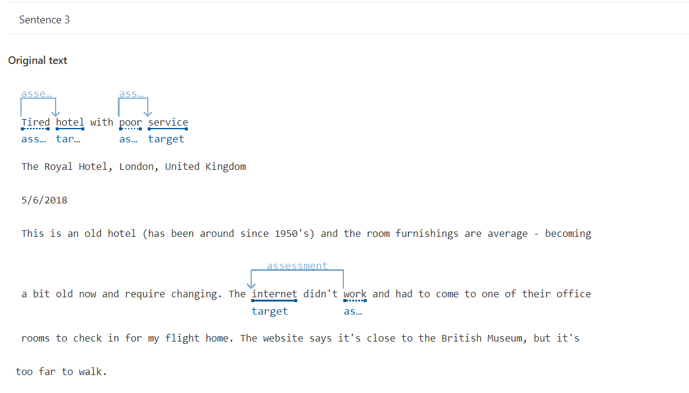

# Automated machine learning in Azure Machine Learning Translating Feelings and Texts and Explaining Audios

Este repositório foi criado para apresentar minha experiência com a ferramenta de Aprendizado de Máquina da Azure utilizando tradução de audio da IA e também explicando sentimentos e fazendo analises textuais complexas dando apoio para a realização de tomadas de decisão, a qual foi aprendida durante o bootcamp da DIO seguindo o(s) seguinte(s) [tutorial 1](https://microsoftlearning.github.io/mslearn-ai-fundamentals/Instructions/Labs/09-speech.html), [tutorial 2](https://microsoftlearning.github.io/mslearn-ai-fundamentals/Instructions/Labs/06-text-analysis.html), do site da Azure AI Language Studio e Speech Studio para empregar uma das ferramentas de Inteligência Artificial disponibilizadas pela Azure. Isso permite explorar diferentes algoritmos e parâmetros para tradução e facilita dublagens e até leitura, no Speech Studio no Language Studio, ele utiliza de ferramentas mais completas para transcrever o sentimento humano em dados e assim fazendo o que a própria ferramenta lhe dê parâmetros para ajudar em decisões de empresas, financeiras e até outros.

## Insight Speech Studio

Falando sobre o Speech Studio, eu acredito que a "tradução" do áudio em texto serve para ser utilizados para coisas como acessibilidade para cegos e surdos/mudos, pode ser implementado para ouvir saber de áudios em momentos inoportunos, bem como dirigir e saber das coisas, acredito que a cada dia que se passa teremos mais tecnologias dessas utilizadas no nosso dia-a-dia.

## Print Speech Studio

## Insight Language Studio

A Language Studio da Microsoft Azure é uma ferramenta poderosa que eu posso usar para analisar sentimentos expressos em texto. Com ela, consigo classificar emoções, como positivas, negativas ou neutras. Essa análise fornece insights valiosos para ajustar estratégias de negócios, melhorar a experiência do cliente e tomar decisões informadas. Em setores financeiros, por exemplo, posso monitorar a reação do mercado a eventos econômicos, prevendo tendências e gerenciando riscos. A ferramenta é altamente personalizável para atender às necessidades específicas e oferece facilidade de integração e escalabilidade. Além disso, prioriza a segurança e privacidade dos dados processados.

## Print 1 Language Studio

## Print 2 Language Studio

## Print 3 Language Studio

## Requisitos

- Criar uma conta grátis no Microsoft Azure e seguir o passo a passo.
